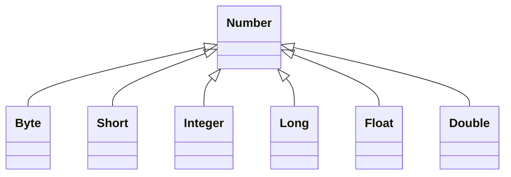

# Trails Covering the Basics

## Learning the Java Language

### Numbers

### Strings

## Essential Java Classes

## Collections

## Date-Time APIs

## Deployment

## Preparation for Java Programming Language Certification
